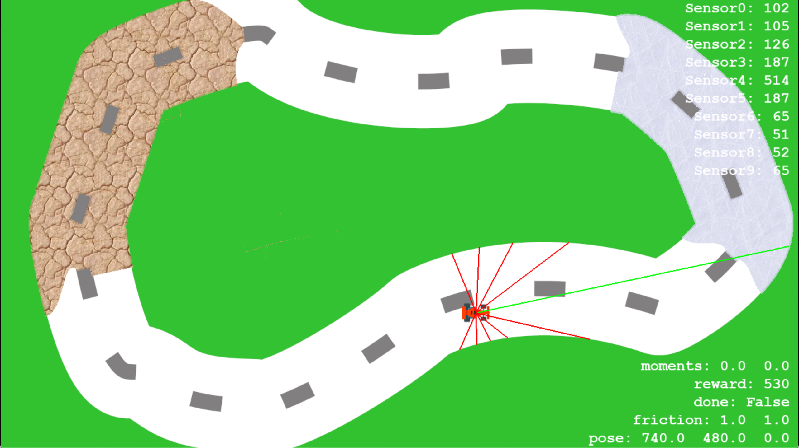

# Reinforcement-Learning-Motion-Planning-for-Autonomous-Driving
by Weiye Zhao, Anthony Liang, Changliu Liu

The repo contains the implementation for reinforcement learning motion planner to ensure safe driving dehavior on extreme road conditions

## High-fidelity Rollout Simulator
The rollout simulator is build on top of [pygame](https://github.com/pygame/). Currenly simple unicycle dynamics model is deployed in simulation. Sensors of autonomous vehicle include ranges sensors, distance to center line, and etc. High-fidelity approximation of real world simulation will be added for future implentation.

### Screenshot of car simulation environment



## Setup instructions

Clone repo:
`git clone --recursive https://github.com/aliang8/icl-safe-driving.git`

`git submodule update --init --recursive`

`cd spinningup/` and `pip3 install -e .`

### Screenshot of car simulation environment


1. Create virtualenv for development
    - `./setup [virtualenv name] [cpu/gpu]`

2. Running the simulator in manual mode:
    - `python3 ICLcar_env/gym_ICLcar/test_car_gym.py -es exp_settings/default_settings.yaml exp_settings/human_settings.yaml`

3. Install the gym environment:
    - `pip install -e ICLcar_env`

4. Test the gym env:
    - `python3 ICLcar_env/gym_ICLcar/test_car_gym.py`

5. Try training a DDPG agent.
    - `python3 -m ipdb -c continue src/train.py -es exp_settings/default_settings.yaml exp_settings/exp_settings.yaml`

6. Train DDPG agent with SpinningUp implementation.
    - `python3 -m ipdb -c continue src/external/spinup_main.py -es exp_settings/default_settings.yaml exp_settings/exp_settings.yaml`

    - `python3 -m ipdb -c continue src/external/spinup_main.py -es exp_settings/default_settings.yaml exp_settings/exp_settings.yaml -eg exp_settings/exp_grid.yaml`

7. Evaluate on trained checkpoint.
    - `python3 -m ipdb -c continue src/external/spinup_main.py -es exp_settings/default_settings.yaml exp_settings/test_settings.yaml`

8. View logs on tensorboard (make sure you first ssh with port forwarding)
    - `tensorboard --logdir={log_dir} --port {server_port} --host localhost`

### Testing Rllab and Spinup implementations of DDPG

Installing rllab
```
  git clone https://github.com/rll/rllab.git
  ./scripts/setup_osx.sh
  source activate rllab3

  conda create -n rllab3 python=3.5
  # might need to create your own requirements.txt if you run into installation errors
```

Install spinningup
```
  git clone https://github.com/openai/spinningup.git
  cd spinningup
  pip install -e .
```

## Reinforcement Learning Motion Planner
